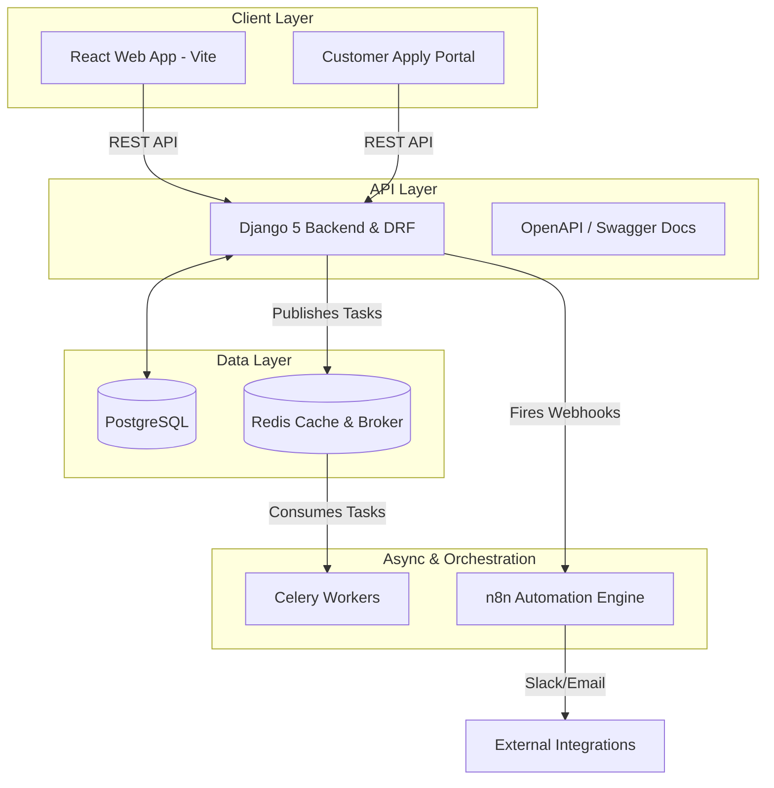
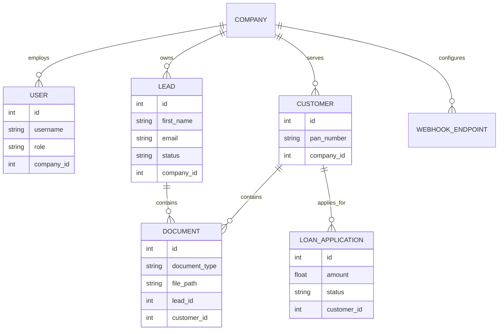

# System Architecture

The Instacapital SaaS platform uses a modern, decoupled microservices architecture designed to be horizontally scalable and multi-tenant out of the box.

## High-Level Component Diagram

## Multi-Tenant Architecture (B2B SaaS)
Unlike single-agency CRMs, Instacapital is built to support **Multiple Companies** (Agencies) under one roof.

### How Data is Partitioned
1. **The `Company` Model:** At the root of the database sits the `Company` model.
2. **Users:** Every `User` (Admin, Manager, Loan Executive) belongs to a specific `Company`. If a User's `company_id` is null, they are considered a Super Admin of the overarching SaaS platform.
3. **Leads & Customers:** Every `Lead`, `Customer`, `LoanApplication`, and `Document` is strictly bound to a `Company`. 
4. **Data Isolation:** The Django Rest Framework `ModelViewSet` queries are overridden so that when a User logs in, they only ever retrieve records that match `request.user.company`. This ensures strict data privacy between agencies.

## Database Entity Relationship (ER) Diagram
Below is a simplified ER diagram of the core business logic.

## Automations & n8n Orchestration

To prevent developers from having to write custom Python code every time a sales team wants to change a welcome email or add a Slack alert, we delegated workflow orchestration to **n8n**.

**The Flow:**
1. **Trigger:** A Django signal (e.g., `post_save` on the `Lead` model) detects that a new Lead was created with `status="NEW"`.
2. **Dispatch:** The Django backend acts as the "Brain", sending a JSON webhook payload to the locally hosted n8n container (`http://localhost:5678`). The payload includes the `company_id` and lead details.
3. **Execution:** n8n catches the webhook. An admin can use n8n's visual drag-and-drop builder to configure what happens next (e.g., checking if `loan_amount > 50000`, and if so, sending an urgent WhatsApp message to the manager).

## Security & Auth Flow
Authentication is managed via JSON Web Tokens (JWT) using `djangorestframework-simplejwt`. 

### Public Customer Auth
Customers applying via the public `/apply` portal do not receive a standard User account to keep the CRM clean. Instead:
1. They request an OTP via `/api/auth/send-otp/`.
2. The backend generates a secure 6-digit pin stored in the `OTPVerification` table.
3. They verify the pin via `/api/auth/verify-otp/`.
4. Once verified, the portal unlocks the document upload wizard. The uploaded documents are securely linked to a "Lead" profile in the CRM for staff to review.
